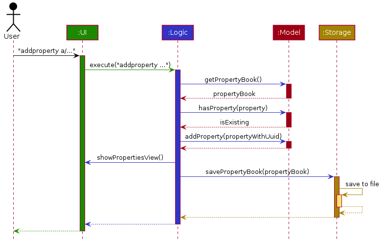
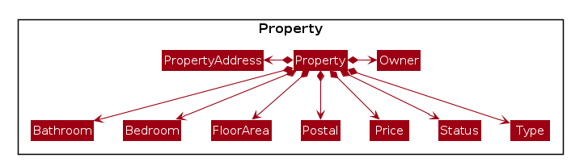

## Table of Contents

1. [Setting up](#1-setting-up)
2. [Design](#2-design)
   1. [Architecture](#21-architecture)
   2. [UI component](#22-ui-component)
   3. [Logic component](#23-logic-component)
   4. [Model component](#24-model-component)
   5. [Storage component](#25-storage-component)
   6. [Common classes](#26-common-classes)
3. [Implementation](#3-implementation)
   1. [Contact management](#32-contact-management)
   2. [Property management](#33-property-management)
   3. [Contact–property linking](#34-contactproperty-linking)
4. [Documentation, Logging, Testing, Configuration, Dev-Ops](#4-documentation-logging-testing-configuration-dev-ops)
5. [Appendix: Command Parameters](#appendix-command-parameters)
6. [Appendix: Product Scope](#appendix-product-scope)
7. [Appendix: User Stories](#appendix-user-stories)
8. [Appendix: Use Cases](#appendix-use-cases)
9. [Appendix: Non-Functional Requirements](#appendix-non-functional-requirements)
10. [Appendix: Glossary](#appendix-glossary)
11. [Appendix: Instructions for Manual Testing](#appendix-instructions-for-manual-testing)
12. [Appendix: Planned Enhancements](#appendix-planned-enhancements)
13. [Appendix: Efforts](#appendix-effort)
14. [Appendix: Continuous Integration](#appendix-continuous-integration--continuous-deployment)

---------------------------------------------------------------------------------------------------------------------

## Acknowledgements

TheRealDeal is a greenfield group project that is based on [addressbook-level3](https://github.com/se-edu/addressbook-level3) (AB3) created by [SE-EDU](https://se-education.org/).

## Legend
These boxes in the Developer Guide has additional information that you should take note of.

**:information_source: Important:** 
Highlights important details to be aware of.

:bulb: **Tip:** 
Provides you with helpful advice like keyboard shortcuts to use the application more effectively.

:exclamation: **Caution:** 
Warns you of potential issues to should watch out for.

---------------------------------------------------------------------------------------------------------------------

## 1. Setting up

Refer to the guide [_Setting up and getting started_](SettingUp.md).

---------------------------------------------------------------------------------------------------------------------

## 2. Design

:bulb: **Tip:** The `.puml` files used to create diagrams are in the `docs/diagrams` folder.  
Click [here](https://se-education.org/guides/tutorials/plantUml.html) to learn how to create and edit the diagrams.

### 2.1. Architecture

The ***Architecture Diagram*** given above explains the high-level design of the App.

Given below is a quick overview of main components and how they interact with each other.

**Main components of the architecture**

**`Main`** (consisting of classes [`Main`](https://github.com/AY2526S1-CS2103T-W10-2/tp/blob/master/src/main/java/seedu/address/Main.java) and [`MainApp`](https://github.com/AY2526S1-CS2103T-W10-2/tp/blob/master/src/main/java/seedu/address/MainApp.java)) is in charge of the app launch and shut down.
* At app launch, it initializes the other components in the correct sequence, and connects them up with each other.
* At shut down, it shuts down the other components and invokes cleanup methods where necessary.

The bulk of the app's work is done by the following four components:

* [**`UI`**](#22-ui-component): The UI of the App.
* [**`Logic`**](#23-logic-component): The command executor.
* [**`Model`**](#24-model-component): Holds the data of the App in memory.
* [**`Storage`**](#25-storage-component): Reads data from, and writes data to, the hard disk.

[**`Commons`**](#26-common-classes) represents a collection of classes used by multiple other components.

**How the architecture components interact with each other**

The *Sequence Diagram* below shows how the components interact when a user runs `addproperty address/123 Orchard Rd postal/238888 ...` to add a new listing.

Each of the four main components (also shown in the diagram above),

* defines its *API* in an `interface` with the same name as the Component.
* implements its functionality using a concrete `{Component Name}Manager` class (which follows the corresponding API `interface` mentioned in the previous point.

For example, the `Logic` component defines its API in the `Logic.java` interface and implements its functionality using the `LogicManager.java` class which follows the `Logic` interface. Other components interact with a given component through its interface rather than the concrete class (reason: to prevent outside component's being coupled to the implementation of a component), as illustrated in the (partial) class diagram below.

The sections below give more details of each component.

### 2.2. UI component

The **API** of this component is specified in [`Ui.java`](https://github.com/AY2526S1-CS2103T-W10-2/tp/blob/master/src/main/java/seedu/address/ui/Ui.java)

The UI consists of a `MainWindow` that is made up of parts e.g.`CommandBox`, `ResultDisplay`, `ContactListPanel`, `PropertyListPanel`, `StatusBarFooter` etc. All these, including the `MainWindow`, inherit from the abstract `UiPart` class which captures the commonalities between classes that represent parts of the visible GUI.

The `UI` component uses the JavaFx UI framework. The layout of these UI parts are defined in matching `.fxml` files that are in the `src/main/resources/view` folder. For example, the layout of the [`MainWindow`](https://github.com/se-edu/addressbook-level3/tree/master/src/main/java/seedu/address/ui/MainWindow.java) is specified in [`MainWindow.fxml`](https://github.com/se-edu/addressbook-level3/tree/master/src/main/resources/view/MainWindow.fxml)

The `UI` component,

* executes user commands using the `Logic` component.
* listens for changes to `Model` data so that the UI can be updated with the modified data.
* keeps a reference to the `Logic` component, because the `UI` relies on the `Logic` to execute commands.
* depends on some classes in the `Model` component, as it displays `Contact` and `Property` object residing in the `Model`.

### 2.3. Logic component

**API** : [`Logic.java`](https://github.com/AY2526S1-CS2103T-W10-2/tp/blob/master/src/main/java/seedu/address/logic/Logic.java)

Here's a (partial) class diagram of the `Logic` component:

The sequence diagram below illustrates the interactions within the `Logic` component, taking `execute("delete 1")` API call as an example.

:information_source: **Note:** The lifeline for `DeleteContactCommandParser` should end at the destroy marker (X) but due to a limitation of PlantUML, the lifeline continues till the end of diagram.

How the `Logic` component works:

1. When `Logic` is called upon to execute a command, it hands the raw text to a `UnifiedCommandParser`, which delegates to feature-specific parsers (e.g. `PropertyBookParser`) until one recognises the syntax (such as `DeleteContactCommandParser`).
1. This results in a `Command` object (more precisely, an object of one of its subclasses e.g., `DeleteContactCommand`) which is executed by the `LogicManager`.
1. The command can communicate with the `Model` when it is executed (e.g. to delete a contact). 
   Note that although this is shown as a single step in the diagram above (for simplicity), in the code it can take several interactions (between the command object and the `Model`) to achieve.
1. The result of the command execution is encapsulated as a `CommandResult` object which is returned back from `Logic`.

Here are the other classes in `Logic` (omitted from the class diagram above) that are used for parsing a user command:

How the parsing works:
* When called upon to parse a user command, assuming the command is valid, the `UnifiedCommandParser` class will pass the command to the responsible parser from the two parser, `AddressBookParser` class and `PropertyBookParser` class.
* The selected parser class will create an `XYZCommandParser` (`XYZ` is a placeholder for the specific command name e.g., `AddCommandParser`) which uses the other classes shown above to parse the user command and create a `XYZCommand` object (e.g., `AddCommand`) which the `AddressBookParser` returns back as a `Command` object.
* All `XYZCommandParser` classes (e.g., `AddContactCommandParser`, `DeleteContactCommandParser`, ...) inherit from the `Parser` interface so that they can be treated similarly where possible e.g, during testing.

### 2.4. Model component
**API** : [`Model.java`](https://github.com/AY2526S1-CS2103T-W10-2/tp/blob/master/src/main/java/seedu/address/model/Model.java)

The `Model` component,

* stores the address book data i.e., all `Contact` objects (which are contained in a `UniqueContactList` object).
* stores the property book data i.e., all `Property` objects (which are contained in a `UniquePropertyList` object).
* stores the currently 'selected' `Contact`/`Property` objects (e.g., results of a filter query) as a separate _filtered_ list which is exposed to outsiders as an unmodifiable `ObservableList<Contact>`/`ObservableList<Property>` that can be 'observed' e.g. the UI can be bound to this list so that the UI automatically updates when the data in the list change.
* stores a `UserPrefs` object that represents the user’s preferences. This is exposed to the outside as a `ReadOnlyUserPrefs` objects.
* does not depend on any of the other three components (as the `Model` represents data entities of the domain, they should make sense on their own without depending on other components)

### 2.5. Storage component

**API** : [`Storage.java`](https://github.com/AY2526S1-CS2103T-W10-2/tp/blob/master/src/main/java/seedu/address/storage/Storage.java)

The `Storage` component,
* can save address book data, property book data and user preference data in JSON format, and read them back into corresponding objects.
* inherits from all of `AddressBookStorage`, `PropertyBookStorage` and `UserPrefStorage`, which means it can be treated as any (if only the functionality of only one is needed).
* depends on some classes in the `Model` component (because the `Storage` component's job is to save/retrieve objects that belong to the `Model`)

### 2.6. Common classes

Classes used by multiple components are in the `seedu.address.commons` package. These classes provide utility functions that are used in many classes such as `StringUtil`, `ToStringBuilder` etc.

---------------------------------------------------------------------------------------------------------------------

## 3. Implementation

This section describes some noteworthy details on how certain features are implemented.

### 3.1. General Features

These features do not require any parameters and do not have a corresponding `Parser` class so is directly instantiated in `AddressBookParser`.

#### <u>Help Command</u> (`help`)
The `HelpCommand` opens up a separate window containing a link to the User Guide.

##### Design Considerations
We designed the `HelpCommand` to let the user copy and navigate to the User Guide link directly.  

:bulb: **Tip:** 
Users can also press the <code>F1</code> key to open the help window

#### <u>List Command</u> (`list`)
The `ListCommand` resets all current filters and displays all the contacts/properties stored in the application.

##### Execution
The `ListCommand` calls the `Model` component to update the `FilteredList<Contact>` and `FilteredList<Property>` to show all of the `Contact` and `Property` in the list.

**:information_source: Important:** 
Users can switch to the list of contacts with: <code>filtercontact</code> 
Users can switch to the list of properties with: <code>filterproperty</code>

##### Design Considerations
We designed the `ListCommand` to provide users with a quick and easy way to view all `Contact` and `Property`.

#### <u>Clear Command</u> (`clear`)
The `ClearCommand` allows users to delete all contacts and properties stored in the application

##### Execution
The `ClearCommand` sets the `Model` to be reference a new `AddressBook` and `PropertyBook` which effectively deletes all data that was previously stored.

##### Design Considerations
We designed the `ClearCommand` to let users easily remove any data stored in the application and start afresh.

#### <u>Exit Command</u> (`exit`)
The `ExitCommand` allows users to close the application.

##### Execution
The `ExitCommand` invokes the `handleExit` method in the `MainWindow` class which closes the UI (including the help window).

##### Design Considerations
As TheRealDeal is a CLI-based application, the `ExitCommand` can be used to exit the application using the CLI.

### 3.2. Contact management

All contacts are stored as `Contact` objects inside the `UniqueContactList` object under the `AdressBook` component.   
There is also an additional `FilteredList<Contact>` inside the `ModelManager` that stores the `Contact` that are displayed on the UI which is updated whenever the user issues a command that changes the UI.

#### <u>Add Command</u> (`addcontact`)
The `addcontact` command is designed to add a new contact to the address book.

Compulsory fields:
- Name
- Phone Number

Optional Fields:
- Address
- Email
- Minimum Budget
- Maximum Budget
- Tag
- Notes
- Status

##### Parsing and Validating User Input
The `AddContactCommandParser` class is responsible for parsing the command input.
It utilises `ArgumentTokenizer` to split the input string based on defined prefixes (`PREFIX_NAME`, `PREFIX_PHONE`, etc)

The parser constructs a new `Contact` object that is wrapped inside a `AddContactCommand`.

Validation done:
- Ensures compulsory fields are present
- Ensures no duplicate fields are provided
- Ensures each individual field meets the constraints of that field (refer [here](#appendix-a-command-parameters) for the constraints)
- Unknown parameters provided will throw a `ParseException`

##### Execution
The `AddContactCommand` class generates the UUID for the `Contact` object and checks for duplicates in the address book before adding the new contact.

#### <u>Delete Command</u> (`deletecontact`)
The `deletecontact` command is designed to delete an existing contact from the address book, identified by their UUID.

Compulsory fields:
- UUID

##### Parsing and Validating User Input
The `DeleteContactCommandParser` class is responsible for parsing the command input.
Documentation pending.

#### <u>Edit Command</u> (`editcontact`)
The `editcontact` command is designed to edit a contact in the address book, identified by their UUID.

Compulsory fields:
- UUID

Optional Fields:
- Name
- Phone Number
- Address
- Email
- Minimum Budget
- Maximum Budget
- Tag
- Notes
- Status

##### Parsing and Validating User Input
The `EditContactCommandParser` class is responsible for parsing the command input.
It utilises `ArgumentTokenizer` to split the input string based on defined prefixes (`PREFIX_NAME`, `PREFIX_PHONE`, etc)
The UUID is also validated and parsed.

The parser creates an `EditContactDescriptor` object that stores the newly edited fields.

Validation done:
- Same validation done as `addcontact`
- At least one field must be edited
- New contact must not already be in the address book

##### Execution
The `EditContactCommand` executes by finding the target contact based on their UUID, creating an edited `Contact` object and updating the contact in the address book with the new details.

#### <u>Filter Contact Command</u> (`filtercontact`)
The `filtercontact` command filters the contacts in the address book based on the criteria given.

Optional Fields:
- Name
- Phone Number
- Address
- Email
- Minimum Budget
- Maximum Budget
- Tag
- Notes
- Status
- Limit
- Offset

##### Parsing and Validating User Input
The `FilterContactCommandParser` is responsible for parsing the command input. It utilises `ArgumentTokenizer` to split the input string based on defined prefixes (`PREFIX_NAME`, `PREFIX_PHONE`, etc)   
A `FilterContactPredicate` is created that encapsulates all the filter conditions and is used to test whether a contact matches the given filters.

Validation done:
- Same validation done as `addcontact`
- Proper data types and formats for numeric fields (e.g. budget, limit, offset)

##### Execution
`FilterContactCommand` applies the `FilterContactPredicate` over the existing filtered contact list and produces a list of matching contacts. It is also changed based on the `limit` and `offset` given.
The UI is then updated based on which contacts that match the predicate.

### 3.3. Property management

#### <u>Add Property Command</u> (`addproperty`)
The `addproperty` command adds a new property to the property book and links it to an existing owner contact.

Compulsory fields:
- Address (`a/`)
- Postal code (`postal/`)
- Price (`price/`)
- Type (`type/`)
- Status (`status/`)
- Bedroom count (`bed/`)
- Bathroom count (`bath/`)
- Floor area (`f/`)
- Listing type (`l/`)
- Owner UUID (`o/`)

Optional Fields:
- None

##### Parsing and Validating User Input
The `AddPropertyCommandParser` tokenises the raw arguments with `ArgumentTokenizer`, ensuring every compulsory prefix appears exactly once.
Each value is parsed via `ParserUtil` into the corresponding domain object (e.g. `PropertyAddress`, `Postal`, `Price`, `Owner`).

Validation done:
- Rejects missing or duplicate compulsory prefixes, raising a `ParseException` with `MESSAGE_USAGE`.
- Ensures each field satisfies its domain constraints (such as postal format, positive price and valid owner identifier).
- Trims surrounding whitespace so that inputs like `a/ 21 Sunset Way` are accepted.

##### Execution
`AddPropertyCommand#execute` requests a fresh UUID from `PropertyBook#generateNextUuid()`. It verifies the specified owner exists in the address book; if not, a `CommandException` with `MESSAGE_OWNER_NOT_FOUND` is thrown.

A duplicate check is then performed, which compares address and postal pairs.
When all checks pass, the property is added, the UI shifts to the property view, and a success message (including the assigned UUID) is returned.

#### <u>Delete Property Command</u> (`deleteproperty`)
The `deleteproperty` command removes an existing property identified by its UUID from the property book.

Compulsory fields:
- Property UUID

##### Parsing and Validating User Input
`DeletePropertyCommandParser` converts the supplied argument into a `Uuid` using `ParserUtil.parsePropertyId`.

Validation done:
- Rejects blank input or extraneous tokens, wrapping the error with `MESSAGE_USAGE`.
- Ensures the UUID is a positive integer within bounds expected by the application.

##### Execution
`DeletePropertyCommand#execute` consults `Model#getFilteredPropertyList()`, which always reflects the latest property filtering applied in the UI (e.g. `list`, `filterproperty`).

For example, after running `filterproperty type/condo`, only the condo subset is searched—even if you subsequently switch to the contacts tab—until another property-filtering command updates the list.
If the supplied UUID is absent from that subset the command throws `MESSAGE_INVALID_PROPERTY_DISPLAYED_ID`; otherwise it deletes the property`, and update the UI accordingly.

#### <u>Filter Property Command</u> (`filterproperty`)
The `filterproperty` command filters the properties in the property book based on the criteria given.

Optional Fields:
- Address
- Postal
- Price
- Type
- Status
- Bedroom
- Bathroom
- Floor Area
- Listing
- Owner
- Limit
- Offset

##### Parsing and Validating User Input
The `FilterPropertyCommandParser` is responsible for parsing the command input. It utilises `ArgumentTokenizer` to split the input string based on defined prefixes (`PREFIX_PROPERTY_ADDRESS`, `PREFIX_PROPERTY_POSTAL`, etc)   
A `PropertyMatchesFilterPredicate` is created that encapsulates all the filter conditions and is used to test whether a property matches the given filters.

Validation done:
- Same validation done as `addproperty`
- Proper data types and formats for numeric fields (e.g. price, limit, offset)

##### Execution
`FilterPropertyCommand` applies the `PropertyMatchesFilterPredicate` over the existing filtered contact list and produces a list of matching contacts. It is also changed based on the `limit` and `offset` given.
The UI is then updated based on which properties that match the predicate.

#### <u>Mark Property as Sold Command</u> (`sold`)
The `sold` command finds properties by they UUID and changes the status of the property to unavailable.

Compulsory fields:
- UUID (using `p/` prefix)

##### Parsing and Validating User Input
The `MarkSoldCommandParser` is responsible for parsing the command input.

Validation done:
- No duplicate UUID is given
- No empty UUID is given
- Property with the given UUID exists

##### Execution
The `MarkSoldCommand` executes by retrieving the `Property` object for each UUID and creating a new `Property` object with the same attributes but with its `Status` as unavailable to replace the old `Property`.

#### <u>Mark Property as Unsold Command</u> (`unsold`)
The `unsold` command finds properties by they UUID and changes the status of the property to unavailable.

Compulsory fields:
- UUID (using `p/` prefix)

##### Parsing and Validating User Input
The `MarkUnsoldCommandParser` is responsible for parsing the command input.

Validation done:
- Same validation done as `sold`

##### Execution
The `MarkUnsoldCommand` executes by retrieving the `Property` object for each UUID and creating a new `Property` object with the same attributes but with its `Status` as unavailable to replace the old `Property`.

### 3.4. Contact–property linking

#### <u>Link Command</u> (`link`)
The `link` command is designed to link contacts in the address book to properties in the property book, as either buyers or sellers, each identified by their UUID.

Compulsory fields:
- Contact UUID
- Property UUID
- Relationship (buyer/seller)

Optional fields:
- Additional contact UUIDs
- Additional property UUIDs

##### Parsing and Validating User Input
The `LinkCommandParser` class is responsible for parsing the command input.
It utilises `ArgumentTokenizer` to split the input string based on defined prefixes (`PREFIX_CONTACT_ID`, `PREFIX_PROPERTY_ID`, `PREFIX_LINK_RELATIONSHIP`)
Each UUID is also validated and parsed.

The parser creates an `LinkDescriptor` object that stores the parsed UUIDs and relationship.

Validation done:
- No duplicate relationship parameter

##### Execution
The `LinkCommand` executes by:
1. Finding the target contacts and properties based on their UUIDs
2. Ensuring none of the targets are already linked
3. Creating new edited `Contact` and `Property` objects with the updated relationship
4. Updating the contacts and properties in the address and property book with the new details.

#### <u>Unlink Command</u> (`unlink`)
The `unlink` command is designed to unlink contacts in the address book from properties in the property book, each identified by their UUID.

Compulsory fields:
- Contact UUID
- Property UUID

Optional fields:
- Additional contact UUIDs
- Additional property UUIDs

##### Parsing and Validating User Input
The `UnlinkCommandParser` class is responsible for parsing the command input.
It utilises `ArgumentTokenizer` to split the input string based on defined prefixes (`PREFIX_CONTACT_ID`, `PREFIX_PROPERTY_ID`)
Each UUID is also validated and parsed.

The parser creates an `UnlinkDescriptor` object that stores the parsed UUIDs and relationship.

##### Execution
The `LinkCommand` executes by:
1. Finding the target contacts and properties based on their UUIDs
2. Ensuring all of the targets were previously linked
3. Creating new edited `Contact` and `Property` objects with buyer and seller relationships removed
4. Updating the contacts and properties in the address and property book with the new details.

#### <u>Show Contacts Command</u> (`showcontacts`)
The `showcontacts` command displays all contacts associated with a specific property by their ID.

Compulsory fields:
- Property ID

##### Parsing and Validating User Input
The `ShowContactsCommandParser` class is responsible for parsing the command input.
It extracts the property ID from the raw input and validates it using `ParserUtil.parsePropertyId`.

The parser creates a `ShowContactsCommand` object with the validated property ID.

Validation done:
- Property ID must be a positive integer
- Property ID format must be valid (non-empty, numeric)

##### Execution
The `ShowContactsCommand` executes by:
1. Creating an `AssociatedWithPropertyPredicate` using the property ID and the full property list from the model
2. Applying this predicate to filter the contact list to show only contacts associated with the specified property
3. Switching the UI view to display the contact list
4. Returning a success message with the count of contacts found, or an error message with suggestions if no contacts are found

The predicate checks if a contact is associated with the property by:
- Checking if the contact owns the property (via the property's owner field)
- Checking if the contact is a buyer of the property (via buyingContactIds)
- Checking if the contact is a seller of the property (via sellingContactIds)

#### <u>Show Properties Command</u> (`showproperties`)
The `showproperties` command displays all properties associated with a specific contact by their ID.

Compulsory fields:
- Contact ID

##### Parsing and Validating User Input
The `ShowPropertiesCommandParser` class is responsible for parsing the command input.
It extracts the contact ID from the raw input and validates it using `ParserUtil.parseContactId`.

The parser creates a `ShowPropertiesCommand` object with the validated contact ID.

Validation done:
- Contact ID must be a positive integer
- Contact ID format must be valid (non-empty, numeric)

##### Execution
The `ShowPropertiesCommand` executes by:
1. Creating an `AssociatedWithContactPredicate` using the contact ID
2. Applying this predicate to filter the property list to show only properties associated with the specified contact
3. Switching the UI view to display the property list via `MainWindow.getInstance().showPropertiesView()`
4. Returning a success message with the count of properties found, or an error message with suggestions if no properties are found

The predicate checks if a property is associated with the contact by using the `Property.isAssociatedWith(contactUuid)` method, which verifies:
- If the contact owns the property (via the property's owner field)
- If the contact is a buyer of the property (via buyingContactIds)
- If the contact is a seller of the property (via sellingContactIds)

### 4. Documentation, Logging, Testing, Configuration, Dev-Ops

[Documentation guide](Documentation.md) 
[Logging guide](Logging.md) 
[Testing guide](Testing.md) 
[Configuration guide](Configuration.md) 
[DevOps guide](DevOps.md)

## Appendix: Command Parameters
This table shows every parameter and prefix used in TheRealDeal.

**:information_source: Important:** 
If the command states that the prefix is optional e.g. <code>n/NAME [t/TAG]</code> 
an empty parameter will be the same as not having the prefix 
e.g. <code>n/NAME t/</code> is the same as <code>n/NAME</code>  
All parameters that expect integers must be entered as **plain digits** — without commas, dots, spaces, or any other separators.

### Contact Management
These are prefixes for purely contact related commands.
Related commands: [`addcontact`](#add-command-addcontact), [`filtercontact`](#filter-contact-command-filtercontact), [`editcontact`](#filter-contact-command-filtercontact)

| Parameter      | Prefix  | Constraints                                                                                                                 |
|----------------|---------|-----------------------------------------------------------------------------------------------------------------------------|
| Name           | n/      | Should only contain alphabetical characters (a-z, A-Z) or spaces                                                            |
| Phone Number   | p/      | Should only contain numbers (0-9), and it should be at least 3 digits long                                                  |
| Email          | e/      | Should follow the format: name@example.com                                                                                  |
| Address        | a/      | Can take any value. Maximum of 200 characters                                                                               |
| Tag            | t/      | Should only be these (case-insensitive): buyer, seller, tenant, landlord                                                    |
| Minimum Budget | min/    | Should be a non-negative integer. If not provided, will have a default of $0                                                |
| Maximum Budget | max/    | Should be a non-negative integer and more than the minimum budget. If not provided, will have a default of $200,000,000,000 |
| Notes          | notes/  | Can take any value. Maximum of 500 characters                                                                               |
| Status         | status/ | Should only be these (case-insensitive): active, inactive                                                                   |

### Property Management
These are prefixes for purely property related commands.
Related commands: [`addproperty`](#addpropertycommand-addproperty), [`filterproperty`](#filter-property-command-filterproperty)

| Parameter      | Prefix  | Constraints                                                                                                          |
|----------------|---------|----------------------------------------------------------------------------------------------------------------------|
| Address        | a/      | Should only contain alphanumerical 5 to 200 characters (a-z, A-Z, 0-9) or spaces, with at least 1 letter and 1 digit |
| Postal code    | p/      | Should only contain numbers (0-9), and it should be exactly least 6 digits long. (Singaporean Postal Code)           |
| Price          | price/  | Should be an integer from 1 to 1 trillion                                                                            |
| Type           | t/      | Should only be these (case-insensitive): hdb, condo, landed, apartment, office, others                               |
| Status         | status/ | Should only be these (case-insensitive): available, unavailable                                                      |
| Bedroom count  | bed/    | Should be an integer from 0 to 20                                                                                    |
| Bathroom count | bath/   | Should be an integer from 0 to 20                                                                                    |
| Floor area     | f/      | Should be an integer from 50 to 100000                                                                               | 
| Owner ID       | o/      | Should be a valid Contact UUID                                                                                       |

### Others
These are prefixes that are used over multiple commands.
Related commands: [`filtercontact`](#filter-contact-command-filtercontact), [`filterproperty`](#filter-property-command-filterproperty), [`sold`](#mark-property-as-sold-command-sold), [`unsold`](#mark-property-as-unsold-command-unsold), [`link`](#linkcommand-link), [`unlink`](#unlinkcommand-unlink), [`showproperties`](#showpropertiescommand-showproperties), [`showcontacts`](#showcontactscommand-showcontacts)

| Parameter      | Prefix  | Constraints                                            |
|----------------|---------|--------------------------------------------------------|
| Limit          | limit/  | An integer more than 0                                 |
| Offset         | offset/ | An integer more than or equals to 0                    |
| Contact UUID   | c/      | Should be a valid Contact UUID                         |
| Property UUID  | p/      | Should be a valid Property UUID                        |
| Relationship   | r/      | Should only be these (case-insensitive): buyer, seller |

## Appendix: Product Scope

**Target user profile**:

* real estate agents
* has to manage a lot of contacts with different informations
* has to manage large property list
* prefer desktop apps over other types
* can type fast
* prefers typing to mouse interactions
* is reasonably comfortable using CLI apps

**Value proposition**: manage contacts faster than a typical mouse/GUI driven app

## Appendix: User Stories

Priorities: High (must have) - `* * *`, Medium (nice to have) - `* *`, Low (unlikely to have) - `*`

| Priority | As a…                        | I want to…                                       | So that I can…                                                           |
| -------- | ---------------------------- | ------------------------------------------------ | ------------------------------------------------------------------------ |
| `* * *`  | user                         | add contacts                                     | keep track of my contacts                                                 |
| `* * *`  | user                         | store properties                                 | keep track of my advertising properties                                  |
| `* * *`  | user                         | delete contacts                                  | remove contacts that I no longer need                                    |
| `* * *`  | user                         | delete properties                                | remove properties that I no longer need                                  |
| `* * *`  | user                         | filter my contacts by their details              | find and prioritise contacts easily                                       |
| `* * *`  | user                         | filter my properties by criteria                 | find my properties for my contacts easily and better match contact's needs |
| `* * *`  | user                         | track contact associations to properties          | easily cross-reference contacts                                           |
| `* * *`  | user                         | track when properties are sold                   | filter them from searches                                                |
| `* * *`  | detail-oriented user         | view a contact’s full profile details             | prepare before meeting or calling them                                   |
| `* *`    | user                         | edit stored information                          | avoid manually deleting and adding data back when something changes      |
| `* *`    | collaborating user           | import Excel contact lists into the system       | avoid adding contacts one by one                                         |
| `* *`    | user                         | record the dates of contact property visits       | maintain a clear history of interactions                                 |
| `* *`    | collaborating user           | export data of contacts                          | pass the information to associated contacts                              |
| `* *`    | user                         | draft messages based on contact profiles          | provide updates quickly and professionally                               |
| `* *`    | user                         | mark contacts as “active” or “inactive”           |                                                                          |
| `* *`    | user                         | store signed contracts                           | quickly retrieve them if disputes or clarifications arise                |
| `* *`    | user                         | generate reports                                 | analyze performance and opportunities                                    |
| `* *`    | user                         | tag contacts with labels                          | organise them better                                                     |
| `* *`    | user                         | track commission earned from each deal           | measure my performance                                                   |
| `* *`    | user                         | have a recent contact list                       |                                                                          |
| `*`      | user dealing with complaints | see the whole interaction history                | understand the context fully and manage the situation well               |
| `*`      | forgetful user               | set automatic reminders for contract expirations | avoid missing key dates                                                  |
| `*`      | user                         | mark and track the negotiation stage of a deal   | see deal progress                                                        |
| `*`      | user                         | generate detailed draft contracts automatically  | speed up the transaction process                                         |
| `*`      | forgetful user               | set reminders for follow-ups with contacts        | avoid forgetting to contact them at the right time                       |

## Appendix: Use Cases

For all use cases below, the **System** is `TheRealDeal` and the **Actor** is the `user`, unless specified otherwise.

#### Use case: UC00 - Input Details

**Guarantee:** 
The input details will meet the required format and constraints for that command

**Main Success Scenario:**
1. User inputs details
2. System successfully parses the input details

   Use case ends

**Extensions**

* 1a. System detects a missing compulsory prefix
  * 1a1. System displays an error message and requests for new inputs

    Use case resumes at step 1  

* 1b. System detects a duplicate prefix
  * 1b1. System displays an error message and requests for new inputs

    Use case resumes at step 1  

* 1c. System detects an invalid prefix
  * 1c1. System displays an error message and requests for new inputs

    Use case resumes at step 1  

* 1d. System detects a parameter not meeting required constraints
  * 1d1. System displays an error message and requests for new inputs

    Use case resumes at step 1  

* 1e. System detects an invalid format
  * 1e1. System displays an error message and requests for new inputs

    Use case resumes at step 1  

* 1f. System detects duplicate details
    * 1e1. System displays an error message and requests for new inputs

      Use case resumes at step 1  

#### Use case: UC01 - Help Command

**Guarantee:** 
Separate help window will pop up

**Main Success Scenario:**
1. User enters the help command
2. System displays main help window

    Use case ends

#### Use case: UC02 - Exit Command

**Guarantee:** 
All application windows are closed

**Main Success Scenario:**
1. User enters the exit command
2. System closes all windows

   Use case ends

#### Use case: UC03 - List Command

**Guarantee:** 
Unfilter list of contacts or properties

**Main Success Scenario:**
1. User enters the list command
2. System will unfilter contacts and properties

   Use case ends

#### Use case: UC04 - Clear Command

**Guarantee:** 
Deletes all contacts and properties

**Main Success Scenario:**
1. User enters the clear command
2. System will delete all contact and property data

   Use case ends

#### Use case: UC05 - Add a contact

**Main Success Scenario:**

1.  User chooses to add a contact and <u>enters the required inputs (UC0)</u>
2.  System stores the required information
3.  System displays a success message

    Use case ends

#### Use case: UC06 - Edit a contact

**Precondition:** The contact exists in the System

**Main Success Scenario:**

1.  User chooses to edit a contact and <u>enters the required inputs (UC0)</u>
2.  System updates the contact with the new details
3.  System displays a success message

    Use case ends

#### Use case: UC07 - Filter all contacts

**Main Success Scenario:**

1.  User chooses to filter contacts and <u>enters the required inputs (UC0)</u>
2.  System filters the contacts based on the details
3.  System displays new contact list

    Use case ends

#### Use case: UC08 - Delete a contact

**Main Success Scenario:**

1.  User chooses to delete a contact and <u>enters the required inputs (UC0)</u>
2.  System deletes the contact specified
3.  System displays a success message

    Use case ends

#### Use case: UC09 - Add a property

**Main Success Scenario:**

1.  User chooses to add a property and <u>enters the required inputs (UC0)</u>
2. System stores the required information
3. System displays a success message

    Use case ends

#### Use case: UC10 - Filter all properties

**Main Success Scenario:**

1.  User chooses to filter properties and <u>enters the required inputs (UC0)</u>
2.  System filters the properties based on the details
3.  System displays new property list

    Use case ends

#### Use case: UC11 - Delete a property

**Main Success Scenario:**

1.  User chooses to delete a property and <u>enters the required inputs (UC0)</u>
2.  System deletes the property specified
3.  System displays a success message

    Use case ends

#### Use case: UC12 - Mark properties as sold

**Main Success Scenario:**

1.  User chooses to mark properties as sold and <u>enters the required inputs (UC0)</u>
2.  System updates the properties as sold
3.  System displays a success message

    Use case ends

#### Use case: UC13 - Mark properties as unsold

**Main Success Scenario:**

1.  User chooses to mark properties as unsold and <u>enters the required inputs (UC0)</u>
2.  System updates the properties as unsold
3.  System displays a success message

    Use case ends

#### Use case: UC14 - Link properties to clients

**Main Success Scenario:**

1.  User chooses to link properties to clients and <u>enters the required inputs (UC0)</u>
2.  System updates the properties and clients
3.  System displays a success message

    Use case ends

#### Use case: UC15 - Unlink properties from clients

**Main Success Scenario:**

1.  User chooses to unlink properties from clients and <u>enters the required inputs (UC0)</u>
2.  System updates the properties and clients
3.  System displays a success message

    Use case ends

#### Use case: UC16 - Find clients linked to a property

**Main Success Scenario:**

1.  User chooses to find clients linked with a property and <u>enters the required inputs (UC0)</u>
2.  System displays a result information

    Use case ends

**Extensions**

* 1a. System finds no clients associated to the property
    * 1a1. System displays error message

      Use case ends

#### Use case: UC17 - Find properties linked to a client

**Main Success Scenario:**

1.  User chooses to find properties linked to a client and <u>enters the required inputs (UC0)</u>
2.  System displays a result information

    Use case ends

**Extensions**

* 1a. System finds no properties linked to a client
    * 1a1. System displays error message

      Use case ends

---------------------------------------------------------------------------------------------------------------------

## Appendix: Non-Functional Requirements

#### Business Rules

1. **User Accessibility**
   * The system should be usable by real estate agents with moderate computer skills
   * Command syntax should be intuitive for real estate professionals
   * Error messages should be domain-specific and actionable for real estate scenarios

2. **Data Integrity**
   * No duplicate contacts or properties should be allowed based on unique identifiers

#### Technical Requirements

1. **Platform Support**
   * The system should support every mainstream OS (Windows, Linux, MacOS) that have Java 17 installed
   * Must work offline without internet connectivity for core functionalities
   * Should be deployable as a single JAR file for easy distribution

2. **Data Management**
   * The system should have automated backups and error recovery processes
   * The system's storage should be scalable and handle large datasets efficiently

3. **User Interface**
   * CLI commands should follow consistent patterns across all operations
   * Display should clearly distinguish between contacts, properties, and associations
   * Must support standard copy-paste operations for data entry

#### Performance Requirements

1. **Response Time**
   * The system should respond to each command within 3 seconds under normal load

2. **Scalability**
   * The system should be able to hold up to 10,000 properties and 10,000 contacts
   * Should efficiently handle relationships between contacts and properties

3. **Resource Efficiency**
   * Memory usage should not exceed 512MB during normal operation
   * Application should run smoothly on systems with 4GB RAM
   * Disk space usage should grow linearly with data volume

#### Constraints

1. **Business Constraints**
   * Must accommodate typical real estate agency workflows

2. **Technical Constraints**
   * Must be developed using Java 17 and JavaFX for GUI components
   * Command-line interface must remain the primary interaction method

---------------------------------------------------------------------------------------------------------------------

## Appendix: Glossary

### Glossary

* **Mainstream OS**: Windows, Linux, Unix, MacOS.
* **CLI**: Command Line Interface, a text-based interface that processes commands to a computer program in the form of lines of text.
* **GUI**: Graphical User Interface, a form of user interface through which users interact with electronic devices via visual indicator representations.
* **API**: Application Programming Interface, specifies the interface through which software and other programs interact.
* **JSON**: JavaScript Object Notation, a text-based data storage format used to store the data of the application.
* **Command**: A specific instruction given to TheRealDeal to perform a certain action, like adding a new contact to the list.
* **Contact**: A domain entity representing a client (buyer or seller) in TheRealDeal system.
* **Prefix**: A unique identifier (e.g., n/, p/, a/) that tells the parser what type of parameter follows.
* **Property**: A domain entity representing a real estate listing with attributes like address, price, type, and availability.
* **ID**: A unique identifier automatically generated by the application to identify contacts and properties. Displayed in the GUI and used in commands. Internally implemented as the `Uuid` class in the codebase.
* **Buyer**: A contact who is interested in purchasing a property. Multiple buyers can be linked to the same property to track all interested parties during negotiations. Being linked as a buyer indicates interest, not completed purchase. Use the `sold` command to mark a property as unavailable once the sale is finalised. 
* **Seller**: A contact role indicating intent to sell properties.
* **Owner**: The contact who legally owns a property, specified via the `o/` parameter when adding properties. Each property must have exactly one owner.
* **Sold**: A property marked as no longer available, achieved using the `sold` command. Sets the property status to "unavailable".
* **Unsold**: A property marked as available for transactions, achieved using the `unsold` command. Sets the property status to "available".
* **Available**: A property status indicating the property is currently on the market and can be sold.
* **Unavailable**: A property status indicating the property has been sold and is no longer on the market.
* **Active**: A contact status indicating the contact is currently engaged and actively working with the agent.
* **Inactive**: A contact status indicating the contact is not currently engaged with the agent or has paused their property search.
* **Relationship**: The type of link between a contact and property, specified using the `link` command as either "buyer" or "seller".

---------------------------------------------------------------------------------------------------------------------

## Appendix: Instructions for Manual Testing

Given below are instructions to test the app manually.

:information_source: **Note:** These instructions only provide a starting point for testers to work on;
testers are expected to do more *exploratory* testing.

### Launch and shutdown

##### Initial launch
To simulate: 
- Download the jar file and copy into an empty folder and double-click the jar file

Expected: 
- Shows the GUI with a set of sample contacts.
- The window size may not be optimum.

##### Saving window preferences
To simulate: 
- Resize the window to an optimum size.
- Move the window to a different location.
- Close the window.
- Re-launch the app by double-clicking the jar file.

Expected: 
The most recent window size and location is retained.

### Filtering and Switching Contact List (`filtercontact`)

##### Switching to contact list view

Command: `filtercontact`

To simulate: 
- Run the command while on any list (e.g., property list).

Expected: 
- The view switches to the contact list.
- Status message confirms the change.

Variations: 
- Run multiple times; the second run should have no visible change.
- Switch from property to contact and back to confirm toggling works.

##### Listing the full contact list

Command: `list`

To simulate: 
- Ensure you are on the contact list page.
- If not, run `filtercontact` to switch to the contact list.
- Run `list`.

Expected: 
- The full contact list is displayed.
- Status message shows success.

Variations: 
- Try `list` after filtering to confirm it resets filters.
- Repeat after editing or deleting a contact to confirm it reflects the latest state.

##### Filtering by name and email

Command: `filtercontact n/Alice e/example.com`

To simulate: 
- Ensure multiple contacts exist.
- Run the command above.

Expected: 
- Lists only contacts whose names include “Alice” and emails include “example.com.”
- Status message shows number of contacts displayed.

Variations: 
- Add more conditions (e.g., `t/buyer`) to confirm multi-prefix filtering.
- Test with mixed casing (e.g., `n/aLiCe`) to confirm case-insensitive matching.

##### Filtering by tag with limits
Command: `filtercontact t/buyer limit/10 offset/1`

To simulate: 
- Ensure contact list contains multiple tagged `buyer`.
- Run the command above.

Expected: 
- Shows up to 10 contacts, skipping the first one.
- Status message indicates count and offset.

Variations: 
- Change limit/offset values to confirm pagination.
- Use invalid tags to confirm error messages.

##### Invalid filter command

Command: `filtercontact abc/Apple`

To simulate: 
- Run the command with an invalid prefix.

Expected: 
- Error message displayed stating invalid parameter.
- Contact list remains unchanged.

Variations: 
- Run `filtercontact abc` to confirm same outcome.
- Run `filtercontact` alone — no change to list.

### Adding a contact

##### Adding a contact with unique details

Command: `addcontact n/Zara Lim p/91234567 e/zara.lim@example.com a/11 Green Lane t/buyer s/active notes/Prefers email`

To simulate: 
- Run `list` to show all contacts and confirm the sample data does not already contain the details above.
- Execute the command.

Expected: 
- Success message `New contact added:` appears.
- The contacts panel shows a new `Zara Lim` card appended with a newly generated UUID (note it for later tests).

Variations: 
- Reorder optional prefixes or include additional tags to ensure the command still succeeds.
- Repeat the command with extra whitespace around prefixes to confirm parsing tolerance.

##### Duplicate contact rejected

Command: `addcontact n/Zara Lim p/91234567 e/zara.lim@example.com a/11 Green Lane t/buyer s/active notes/Prefers email`

To simulate: 
- Ensure the contact from the previous scenario still exists.
- Rerun the command above.

Expected: 
- Command fails with `This contact already exists in the address book`.
- Contact list remains unchanged.

Variations: 
- Vary capitalisation while keeping values identical and observe the same rejection.
- Attempt the command after filtering the contact list to verify the error message still appears.

##### Missing compulsory addcontact field

Command: `addcontact n/Zara Lim`

To simulate: 
- Run the command above.

Expected: 
- Command fails with an error stating that the phone parameter is missing and the usage message is displayed.
- No new contact appears.

Variations: 
- Try `addcontact` with no arguments to observe the generic usage error.
- Try `addcontact n/Zara Lim p/91234567 p/98765432` to see the duplicate prefix error.

### Editing a Contact

##### Editing a contact’s phone number

Command: `editcontact 1 p/99272757`

To simulate: 
- Run `list` to show all contacts.
- Choose a contact with ID 1.
- Execute the command above.

Expected: 
- The contact with ID `1` has its phone updated to `99272757`.
- Details of the updated contact appear in the status message.

Variations: 
- Change multiple fields (e.g., add `e/alice@newmail.com`) to confirm updates apply correctly.
- Include extra whitespace between prefixes to confirm parsing tolerance.

##### Missing field in edit command

Command: `editcontact 1`

To simulate: 
- Run the command with no additional fields.

Expected: 
- No contact is edited.
- Error message indicates missing field(s).

Variations: 
- Run `editcontact` alone to observe the same error.
- Try invalid indexes (e.g., `editcontact 0`, `editcontact 999`) to confirm error handling.

### Deleting a contact

##### Deleting a contact by UUID

Command: `deletecontact <CONTACT_UUID>`

To simulate: 
- Run `list` and identify the UUID printed on the `Zara Lim` card (or another contact to delete).
- Replace `<CONTACT_UUID>` with the exact UUID and run the command.

Expected: 
- Result box shows `Deleted Contact:` followed by the contact details.
- The selected contact is removed and the status bar timestamp updates.

Variations: 
- Delete a different contact to confirm behaviour is consistent.
- Perform the command after filtering the contact list to ensure deletion uses the displayed UUID.

##### Invalid contact UUID

Command: `deletecontact 9999`

To simulate: 
- Ensure no contact currently has the UUID `9999`.
- Run the command above.

Expected: 
- Command fails with `No contact found with ID: 9999`.
- Contact list stays the same.

Variations: 
- Run `deletecontact` without arguments to observe the invalid command format error.
- Run `deletecontact abc` to see the invalid UUID message.

### Filtering and Switching Property List (`filterproperty`)

##### Switching to property list view

Command: `filterproperty`

To simulate: 
- Run from any list, e.g., contact list.

Expected: 
- View switches to show property list.
- Status message confirms switch.

Variations: 
- Run repeatedly — should not duplicate effect.
- Switch back and forth between `filtercontact` and `filterproperty`.

##### Listing the full property list

Command: `list`

To simulate: 
- Ensure you are on the property list page.
- If not, run `filterproperty`.
- Execute `list`.

Expected: 
- All properties are displayed.
- Success message appears.

Variations: 
- Run after filtering to ensure it resets view.
- Repeat after add/delete operations to confirm accuracy.

##### Filtering by address and bedrooms

Command: `filterproperty a/Geylang bed/3`

To simulate: 
- Display multiple properties.
- Execute command.

Expected: 
- Lists only properties in “Geylang” with 3 bedrooms.
- Status shows number listed.

Variations: 
- Include more prefixes (e.g., `type/condo`) to confirm multi-criteria filtering.
- Use case variations to test matching.

##### Invalid filterproperty command

Command: `filterproperty abc/Apple`

To simulate: 
- Run the command with an unrecognized prefix.

Expected: 
- Error message shown.
- Property list unchanged.

Variations: 
- Run `filterproperty abc` to verify same behavior.
- Provide duplicate prefixes (e.g. two `type/` values) to observe the corresponding error message.

### Adding a property

##### Adding a property linked to an existing owner

Command: `addproperty a/21 Sunset Way postal/597145 price/1850000 type/condo status/available bed/3 bath/2 f/1180 l/sale o/1`

To simulate: 
- Run `list` to show both contacts and properties.
- Note the UUID of an existing owner contact (e.g. `1` for Alex Yeoh in sample data) and replace `o/1` with that value.
- Execute the command.

Expected: 
- Success message `New property added:` appears.
- Properties panel shows a new entry with the supplied details and a freshly generated UUID.

Variations: 
- Adjust optional fields (e.g. number of bedrooms) to verify they are captured correctly.
- Repeat with additional whitespace between prefixes to confirm parsing tolerance.

##### Owner contact does not exist

Command: `addproperty a/21 Sunset Way postal/597145 price/1850000 type/condo status/available bed/3 bath/2 f/1180 l/sale o/9999`

To simulate: 
- Ensure no contact currently has the UUID `9999`.
- Run the command above.

Expected: 
- Command fails with `Owner contact ID must match an existing contact (received: 9999).`
- Property list remains unchanged.

Variations: 
- Replace `9999` with other non-existent UUIDs to see the same error.
- Try negative UUID values to observe the invalid format message.

##### Invalid addproperty commands

Command: `addproperty`

To simulate: 
- Run the command above with no parameters.
- Repeat with `addproperty a/21 Sunset Way postal/597145 price/1850000 type/condo status/available bed/3 bath/2 f/1180 l/sale o/` to omit the owner ID.

Expected: 
- Command fails with invalid format or constraint messages explaining the missing or malformed prefixes.
- No properties are added.

Variations: 
- Provide duplicate prefixes (e.g. two `price/` values) to observe the corresponding error message.
- Mix upper- and lower-case prefixes to ensure only the documented format is accepted.

### Deleting a property

##### Deleting a property by UUID

Command: `deleteproperty <PROPERTY_UUID>`

To simulate: 
- Run `list` and identify the UUID of the property added earlier (or any property to delete).
- Replace `<PROPERTY_UUID>` with the actual UUID and execute the command.

Expected: 
- Result box shows `Deleted property:` followed by the property details.
- Property is removed from the list and the status bar timestamp updates.

Variations: 
- Delete a property from a filtered list to confirm behaviour is consistent.
- Attempt deletion immediately after adding a property to verify the UUID remains valid.

##### Invalid property UUID

Command: `deleteproperty 9999`

To simulate: 
- Ensure no property currently has the UUID `9999`.
- Run the command above.

Expected: 
- Command fails with `The property's id provided is invalid`.
- Property list remains unchanged.

Variations: 
- Run `deleteproperty` with no arguments to observe the invalid command format error.
- Run `deleteproperty abc` to see the invalid UUID message.

### Viewing help

##### Opening the help window via command box

Command: `help`

To simulate: 
- Run the command above from the command box.

Expected: 
- Result box shows `Opened help window.`
- The Help window pops up and the command box is cleared.

Variations: 
- Invoke the command repeatedly to ensure the Help window re-focuses without duplicating.
- Trigger the command after switching between tabs to confirm consistent behaviour.

##### Extraneous parameters ignored

Command: `help 123`

To simulate: 
- Run the command above while the application is open.

Expected: 
- Same behaviour as `help`.
- Existing Help window is brought to the front (or remains minimised if previously minimised).

Variations: 
- Replace `123` with other tokens (e.g. `/foo`) to ensure they are ignored.
- Issue the command while the Help window is already focused.

### Clearing All Entries

##### Clearing contacts and properties

Command: `clear`

To simulate: 
- Run `list` to confirm data presence.
- Execute the command above. 

Expected: 
- All contacts and properties are removed.
- Success message shown in status.
- Lists are empty.

Variations: 
- Add new contact/property, then rerun `clear` to confirm both lists reset.
- Confirm no partial deletion occurs.

### Exiting the program

##### Exiting from the main window

Command: `exit`

To simulate: 
- Run the command above from the main window.

Expected: 
- Result box shows `Exiting Address Book as requested ...`.
- Both the main GUI and any Help window close.

Variations: 
- Exit immediately after launching to ensure no confirmation dialog appears.
- Execute `exit` after filtering the contact list to confirm unsaved filters do not block shutdown.

##### Exiting while the Help window is open

Command: `exit`

To simulate: 
- Run `help` to open the Help window.
- Run the command above.

Expected: 
- Both the main GUI and Help window close.
- Application can be relaunched to continue testing.

Variations: 
- Trigger `exit` from the Help window's focus to ensure the main window still closes.
- Repeat after moving the Help window to another monitor.

### Marking properties as sold

##### Marking unsold as sold

Command: `sold p/UUID`

To simulate: 
- Have at least 1 *available* property in the current filtered property list.
- Run the above command with UUID replaced with the UUID of an *available* property in the current filtered property list.

Expected: 
- Displays the following success message: `Marked 1 property(ies) as sold.`
- GUI should display property book.
- The property with UUID input to the command should have its *status* set to *unavailable*.

Variations: 
- Add more parameters with prefix p/ with UUIDs of *available* properties.
- Add arbitrary whitespace.

##### Marking sold as sold

Command: `sold p/UUID`

To simulate:  
- Have at least 1 *unavailable* property in the current filtered property list.
- Run the above command with UUID replaced with the UUID of an *unavailable* property in the current filtered property list.

Expected: 
- Displays the following error message: `TBA`
- No change to the GUI.

Variations: 
- Add more parameters with prefix p/ with valid property UUIDs. A similar output should display as long as one property input is *unavailable*.
- Add arbitrary whitespace.

##### Marking invalid properties as sold

Command: `sold p/UUID`

To simulate:  
- Run the above command with UUID replaced with a value that is not the same as any of the property UUIDs in the current filtered property list.

Expected: 
- Displays the following error message: `The properties with the following IDs were not found: UUID` `Command has been aborted.`
- No change to the GUI.

Variations: 
- Add more parameters with prefix p/ with valid or invalid property UUIDs. A similar output should display as long as one property UUID cannot be found.
- Using a UUID that is less than or equal to 0. Alternate error message: `UUID is not a valid format.`
- Add arbitrary whitespace.

##### Marking as sold with unknown parameters

Command: `sold ...`

To simulate:  
- Run `sold` with any other parameters.

Expected: 
- Displays the following error message: `Invalid command format!` `sold: Marks one or more properties as sold.` `Parameters: p/UUID...` `Example: sold p/14 p/27`
- No change to the GUI.

### Marking properties as unsold

##### Marking sold as unsold

Command: `unsold p/UUID`

To simulate: 
- Have at least 1 *unavailable* property in the current filtered property list.
- Run the above command with UUID replaced with the UUID of an *unavailable* property in the current filtered property list.

Expected: 
- Displays the following success message: `Marked 1 property(ies) as unsold.`
- GUI should display property book.
- The property with UUID input to the command should have its *status* set to *available*.

Variations: 
- Add more parameters with prefix p/ with UUIDs of *unavailable* properties.
- Add arbitrary whitespace.

##### Marking unsold as unsold

Command: `unsold p/UUID`

To simulate:  
- Have at least 1 *available* property in the current filtered property list.
- Run the above command with UUID replaced with the UUID of an *available* property in the current filtered property list.

Expected: 
- Displays the following error message: `TBA`
- No change to the GUI.

Variations: 
- Add more parameters with prefix p/ with valid property UUIDs. A similar output should display as long as one property input is *available*.
- Add arbitrary whitespace.

##### Marking invalid properties as unsold

Command: `unsold p/UUID`

To simulate:  
- Run the above command with UUID replaced with a value that is not the same as any of the property UUIDs in the current filtered property list.

Expected: 
- Displays the following error message: `The properties with the following IDs were not found: UUID` `Command has been aborted.`
- No change to the GUI.

Variations: 
- Add more parameters with prefix p/ with valid or invalid property UUIDs. A similar output should display as long as one property UUID cannot be found.
- Using a UUID that is less than or equal to 0. Alternate error message: `UUID is not a valid format.`
- Add arbitrary whitespace.

##### Marking as unsold with unknown parameters

Command: `unsold ...`

To simulate:  
- Run `unsold` with any other parameters.

Expected: 
- Displays the following error message: `Invalid command format!` `unsold: Marks one or more properties as unsold` `Parameters: p/UUID...` `Example: unsold p/7 p/33`
- No change to the GUI.

### Linking contacts to properties

##### Linking unlinked contacts and properties

Command: `link p/CONTACT_ID r/seller p/PROPERTY_ID`

To simulate: 
- Have at least 1 contact and 1 property in the current filtered contact and property list that do not have each others' UUIDs in their `Buying Property IDs`/`Buyer IDs` or `Selling Property IDs`/`Seller IDs` data.
- Run the above command with CONTACT_ID replaced with the UUID of said contact, PROPERTY_ID replaced with the UUID of said property.

Expected: 
- Displays the following success message: `Linked Property IDs: [[PROPERTY_ID]] with Contact IDs: [[CONTACT_ID]] as seller`
- The property with UUID input to the command should have its `Seller IDs` include the UUID of the contact input.
- The contact with UUID input to the command should have its `Selling Property IDs` include the UUID of the property input.

Variations: 
- Change relationship from buyer to seller.
- Add more parameters with prefix p/ with UUIDs of properties that are not linked to input contacts as buyers or sellers.
- Add more parameters with prefix c/ with UUIDs of contacts that are not linked to input properties as buyers or sellers.
- Add arbitrary whitespace.

##### Linking linked contacts and properties

Command: `link p/CONTACT_ID r/seller p/PROPERTY_ID`

To simulate: 
- Have at least 1 contact and 1 property in the current filtered contact and property list that has any of each others' UUIDs in their `Buying Property IDs`/`Buyer IDs` or `Selling Property IDs`/`Seller IDs` data.
- Run the above command with CONTACT_ID replaced with the UUID of said contact, PROPERTY_ID replaced with the UUID of said property.

Expected: 
- Displays the following error message: `A contact is already linked to one of the properties as RELATIONSHIP`
- No change to the GUI.

Variations: 
- Change relationship from buyer to seller.
- Add more parameters with prefix p/ with valid property UUIDs. A similar output should display as long as any contact and property input are already linked with specified relationship.
- Add more parameters with prefix c/ with valid contact UUIDs. A similar output should display as long as any contact and property input are already linked with specified relationship.
- Add arbitrary whitespace.

##### Linking invalid parameters

Command: `link p/CONTACT_ID r/seller p/PROPERTY_ID`

To simulate: 
- Have at least 1 contact in the current filtered contact list.
- Have at least 1 property not in the current filtered property list.
- Run the above command with CONTACT_ID replaced with the UUID of said contact, PROPERTY_ID replaced with the UUID of said property.

Expected: 
- Displays the following error message: `A property id provided is invalid`
- No change to the GUI.

Variations: 
- Change relationship from buyer to seller.
- Add more parameters with prefix p/ with valid property UUIDs. A similar output should display as long as at least 1 property UUID input is invalid.
- Add more parameters with prefix c/ with valid contact UUIDs. A similar output should display as long as at least 1 property UUID input is invalid.
- Repeat with valid PROPERTY_ID but not present CONTACT_ID. Alternate error message: `A contact id provided is invalid`
- Using a UUID that is less than or equal to 0. Alternate error message: `UUID is not a valid format.`
- Using a RELATIONSHIP other than `buyer` or `seller`. Alternate error message: `The relationship provided is invalid`
- Add arbitrary whitespace.

##### Linking with unknown parameters

Command: `link ...`

To simulate:  
- Run `link` with any other parameters.

Expected: 
- Displays the following error message: `Invalid command format!` `link: Links properties to contacts.` `Parameters: p/PROPERTY_ID... r/RELATIONSHIP (must be either 'buyer' or 'seller') c/CONTACT_ID...` `Example: link p/2 r/buyer c/3 c/5`
- No change to the GUI.

### Unlinking contacts from properties

##### Uninking linked contacts and properties

Command: `unlink p/CONTACT_ID p/PROPERTY_ID`

To simulate: 
- Have at least 1 contact and 1 property in the current filtered contact and property list all have each others' UUIDs in either their `Buying Property IDs`/`Buyer IDs` or `Selling Property IDs`/`Seller IDs` data.
- Run the above command with CONTACT_ID replaced with the UUID of said contact, PROPERTY_ID replaced with the UUID of said property.

Expected: 
- Displays the following success message: `Unlinked Property IDs: [[PROPERTY_ID]] with Contact IDs: [[CONTACT_ID]]`
- The property with UUID input to the command should have its `Seller IDs` exclude the UUID of the contact input.
- The property with UUID input to the command should have its `Buyer IDs` exclude the UUID of the contact input.
- The contact with UUID input to the command should have its `Buying Property IDs` exclude the UUID of the property input.
- The contact with UUID input to the command should have its `Selling Property IDs` exclude the UUID of the property input.

Variations: 
- Add more parameters with prefix p/ with UUIDs of properties that are linked to input contacts as buyers or sellers.
- Add more parameters with prefix c/ with UUIDs of contacts that are linked to input properties as buyers or sellers.
- Add arbitrary whitespace.

##### Unlinking unlinked contacts and properties

Command: `unlink p/CONTACT_ID p/PROPERTY_ID`

To simulate: 
- Have at least 1 contact and 1 property in the current filtered contact and property list that do not have each others' UUIDs in both their `Buying Property IDs`/`Buyer IDs` and `Selling Property IDs`/`Seller IDs` data.
- Run the above command with CONTACT_ID replaced with the UUID of said contact, PROPERTY_ID replaced with the UUID of said property.

Expected: 
- Displays the following error message: `A contact is not linked to any of the properties`
- No change to the GUI.

Variations: 
- Add more parameters with prefix p/ with valid property UUIDs. A similar output should display as long as any contact and property input are not linked.
- Add more parameters with prefix c/ with valid contact UUIDs. A similar output should display as long as any contact and property input are not linked.
- Add arbitrary whitespace.

##### Unlinking invalid parameters

Command: `unlink p/CONTACT_ID p/PROPERTY_ID`

To simulate: 
- Have at least 1 contact in the current filtered contact list.
- Have at least 1 property not in the current filtered property list.
- Run the above command with CONTACT_ID replaced with the UUID of said contact, PROPERTY_ID replaced with the UUID of said property.

Expected: 
- Displays the following error message: `A property id provided is invalid`
- No change to the GUI.

Variations: 
- Add more parameters with prefix p/ with valid property UUIDs. A similar output should display as long as at least 1 property UUID input is invalid.
- Add more parameters with prefix c/ with valid contact UUIDs. A similar output should display as long as at least 1 property UUID input is invalid.
- Repeat with valid PROPERTY_ID but not present CONTACT_ID. Alternate error message: `A contact id provided is invalid`
- Using a UUID that is less than or equal to 0. Alternate error message: `UUID is not a valid format.`
- Add arbitrary whitespace.

##### Unlinking with unknown parameters

Command: `unlink ...`

To simulate:  
- Run `unlink` with any other parameters.

Expected: 
- Displays the following error message: `Invalid command format!` `unlink: unlinks properties from contacts.` `Parameters: p/PROPERTY_ID... c/CONTACT_ID...` `Example: unlink p/2 p/5 c/3`
- No change to the GUI.

### Show contacts linked to or owners of properties

##### Show contacts linked to or owners of property

Command: `showcontacts PROPERTY_ID`

To simulate: 
- Have at least 1 contact and 1 property in the current filtered contact and property list where the contact is linked as buyer or seller, or is the owner of said property.
- Run the above command with PROPERTY_ID replaced with the UUID of said property.

Expected: 
- Displays the following success message: `Listed 1 contact associated with property ID: [PROPERTY_ID]`
- GUI should display address book with only contacts linked or owning the input property.

Variations: 
- Add arbitrary whitespace.

##### Show contacts with invalid parameters

Command: `showcontacts PROPERTY_ID`

To simulate: 
- Run the above command with PROPERTY_ID replaced with the UUID of a property not in the property list.

Expected: 
- Displays the following error message: `No contacts found associated with property ID: [PROPERTY_ID]` `Possible reasons:` `  • The property exists but has no linked contacts yet` `  • The property ID doesn't exist (use 'list' & 'filtercontact' to verify)` `Tip: Use 'link p/[PROPERTY_ID] c/CONTACT_ID r/RELATIONSHIP' to associate contacts with this property.`
- No change to the GUI.

Variations: 
- Using a UUID that is less than or equal to 0. Alternate error message: `UUID is not a valid format.`
- Add arbitrary whitespace.

##### Show contacts with unknown parameters

Command: `showcontacts ...`

To simulate:  
- Run `showcontacts` with any other parameters.

Expected: 
- Displays the following error message: `Invalid command format!` `showcontacts: Shows all contacts associated with the specified property.` `Parameters: PROPERTY_UUID (must be a positive integer)` `Example: showcontacts 123`
- No change to the GUI.

### Show properties linked to or owned by contacts

##### Show properties linked to or owned by contact

Command: `showproperties CONTACT_ID`

To simulate: 
- Have at least 1 contact and 1 property in the current filtered contact and property list where the property is linked as buying or selling, or is the owned by said contact.
- Run the above command with CONTACT_ID replaced with the UUID of said contact.

Expected: 
- Displays the following success message: `Listed 1 property associated with contact ID: [CONTACT_ID]`
- GUI should display property book with only properties linked or owned by the input contact.

Variations: 
- Add arbitrary whitespace.

##### Show properties with invalid parameters

Command: `showproperties CONTACT_ID`

To simulate: 
- Run the above command with CONTACT_ID replaced with the UUID of a contact not in the property list.

Expected: 
- Displays the following error message: `No properties found associated to contact ID: [CONTACT_ID]` `Possible reasons:` `  • The contact exists but is not linked to any properties yet` `  • The contact ID doesn't exist (use 'list' & 'filterproperty' to verify)` `Tip: Use 'addproperty ... o/[CONTACT_ID]' to add a property for this contact.`
- No change to the GUI.

Variations: 
- Using a UUID that is less than or equal to 0. Alternate error message: `UUID is not a valid format.`
- Add arbitrary whitespace.

##### Show properties with unknown parameters

Command: `showproperties ...`

To simulate:  
- Run `showproperties` with any other parameters.

Expected: 
- Displays the following error message: `Invalid command format!` `showproperties: Shows all properties associated with the specified contact.` `Parameters: CONTACT_UUID (must be a positive integer)` `Example: showproperties 123`
- No change to the GUI.

### Saving data

##### Missing data file
To simulate: 
- Delete the `\data` folder and all `.json` files inside.

Expected: 
- Opening the application will generate sample data based on `SampleDataUtil.java`.
- Adding or editing any contacts/properties will save the data inside the `\data` folder.

##### Corrupted data file
To simulate: 
- Open `\data\addressbook.json` and add a `@` to `Contact` Name.

Expected: 
- Opening the application will delete all contacts stored inside `addressbook.json`.
- No contacts will be shown on the GUI.
- Same steps can be carried out for `propertybook.json` by adding `abc` to `Property` Listing.

##### Editing data file while application is open
To simulate: 
- Open application and delete the `\data` folder and all `.json` files inside.

Expected: 
- No change in the GUI and performing any command that adds or edits any contacts/properties will recreate the `\data` folder and the previously deleted `.json` files.

---------------------------------------------------------------------------------------------------------------------

## Appendix: Planned Enhancements

Team size: 5

1. **Allow special characters to be used in contact names.** The current validation for contact names requires it to only consist of alphanumeric characters and spaces. The does not support names with special characters like `/` or `-` (e.g. `s/o`, `John-Mary`). Future improvements aim to support this functionality.

---------------------------------------------------------------------------------------------------------------------

## Appendix: Effort

#### Difficulty Level and Effort Required
This project was significantly harder and took more time than the individual project. TheRealDeal is the first team-based software engineering project for all of us. Most of us had prior experience with a two-man project for NUS Orbital (CP2106) but this group project made it very difficult to split the workload and coordinate features.
  
Unlike AB3 which handles only `Contact`, this application handles both `Contact` and `Property` each with their distinct commands, models and UI components. This required a clear separation and linking between contacts and properties. Furthermore, this project was made significantly harder with the need of a comprehensive User Guide and Developer Guide.
  
A high proportion of effort was saved through reuse of AB3. Such examples include the `ReadOnlyPropertyBook` and `PropertyBook` which takes reference from `ReadOnlyAddressBook` and `AddressBook` which made it easier to implement the `Property` class as AB3 was easily extendable.

#### Challenges Faced
- More comprehensive input validation and testing because it is a CLI-based application
- Coordinating and agreeing on a use case and format of a command as many changes were made week after week
- Implementing complex parsers due to the presence of compulsory parameters, optional parameters or multi-word parameters

#### Achievements of the Project
- Extensive refactoring of AB3 with over 15,000 more lines of code with a high test coverage
- Comprehensive features that extend AB3 into a real estate management application
- Team collaboration and Software Engineering Principles (Git workflow, Issue tracking, Single Level of Abstraction, Logging)
- Extensive User Guide and Developer Guide with the aid of (Unified Modelling Language) UML diagrams

---------------------------------------------------------------------------------------------------------------------

## Appendix: Software Engineering Practices
Common Software Engineering Practices (SEP) has been carried out throughout this project. Testing is done automatically after each code change and is also deployed to GitHub at the same time.  

SEP has been carried out as follows:
1. Unit Testing and Test Coverage Analysis
2. Integrated GitHub tests (Continuous Integration / Continuous Deployment)
3. Version Control (GitHub)

#### Unit Testing and Test Coverage Analysis
Unit testing has been carried out in the form of [JUnit](https://docs.junit.org/current/user-guide/) tests of almost all Java classes. There are currently over 600 different test cases which can be seen [here](https://github.com/AY2526S1-CS2103T-W10-2/tp/tree/master/src/test).    
Test coverage refers to the extent in which the code is tested, and we have utilised [CodeCov](https://about.codecov.io/) to measure our code coverage. The code coverage can be seen [here](https://app.codecov.io/github/AY2526S1-CS2103T-W10-2/tp).    
As of v1.5, the test coverage is above 80%.

#### Integrated GitHub tests (Continuous Integration / Continuous Deployment)
We have utilised _**GitHub Actions**_ to carry out automated testing on Windows, MacOS and Ubuntu devices on every push or pull request. Through these tests, feature branches can be tested before they are merged to the master branch, which ensures that regressions are caught early and are not deployed.
The workflow file used can be seen [here](https://github.com/AY2526S1-CS2103T-W10-2/tp/blob/3fef75e58132ad7d04d4d2cfef54b701466e2f22/.github/workflows/gradle.yml).

#### Version Control (GitHub)
We have carried out version control in the form of GitHub Releases which can be seen [here](https://github.com/AY2526S1-CS2103T-W10-2/tp/releases).
